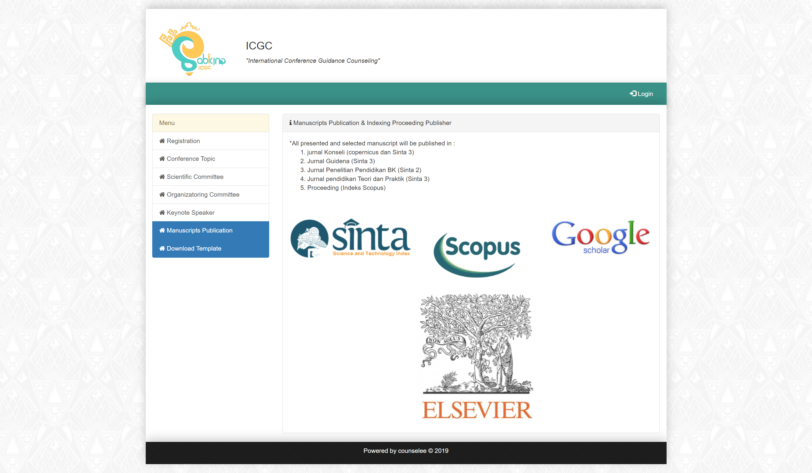

# International Conference Registration
aplikasi pendaftaran konferensi internasional

## Persiapan
- PHP 5.6
- Codeigniter 3
- MySql

## Langkah - Langkah
- Clone project
- Buat database contoh: db_icgc
- import database dari file db_icgc.sql

## Screenshot

1. halaman Keynote Speaker

2. halaman Organization Committee

3. halaman Payment

4. halaman Profile

5. halaman Publication

6. halaman Registration

7. halaman Revision

8. halaman Scientific Committee

9. halaman Submission

10. halaman Topic

11. halaman Verrified

10. halaman List

## Penutup
Support saya untuk terus berbagi, dengan mendoakan saya dan keluarga selalu dalam keadaan sehat, diampuni dosa, dimurahkan rejeki, selamat dari siksa kubur, dimudahkan segala urusan, dijamin masuk surga. Amiiin

Jika ingin berbagi sedikit rejeki berikut saya lampirkan akun dana saya 0816564142

Terimakasih !
